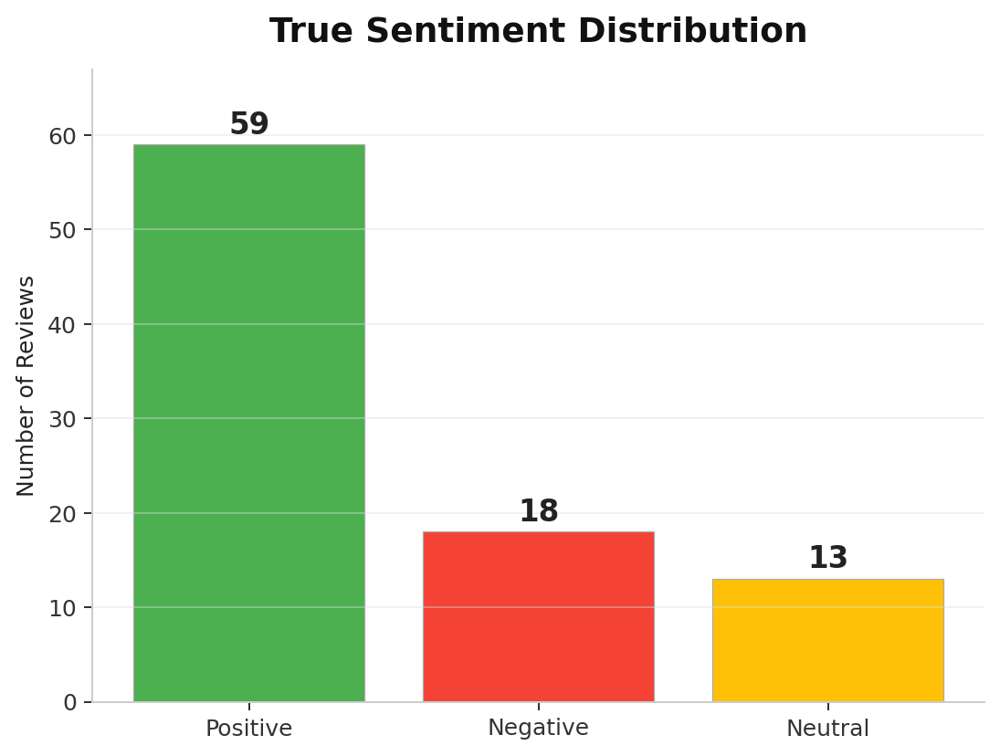
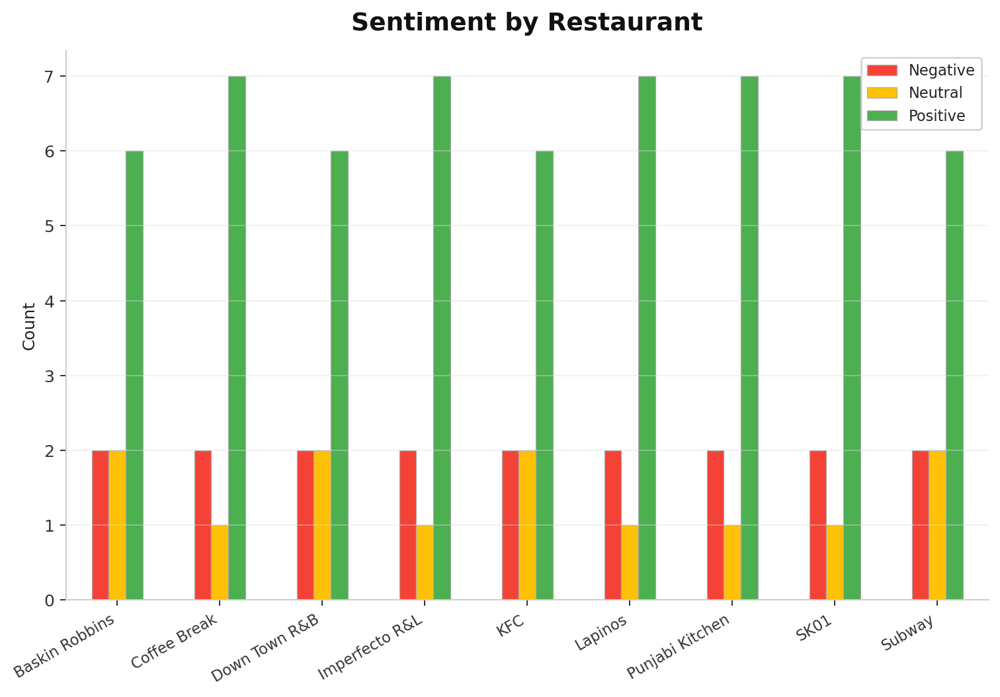
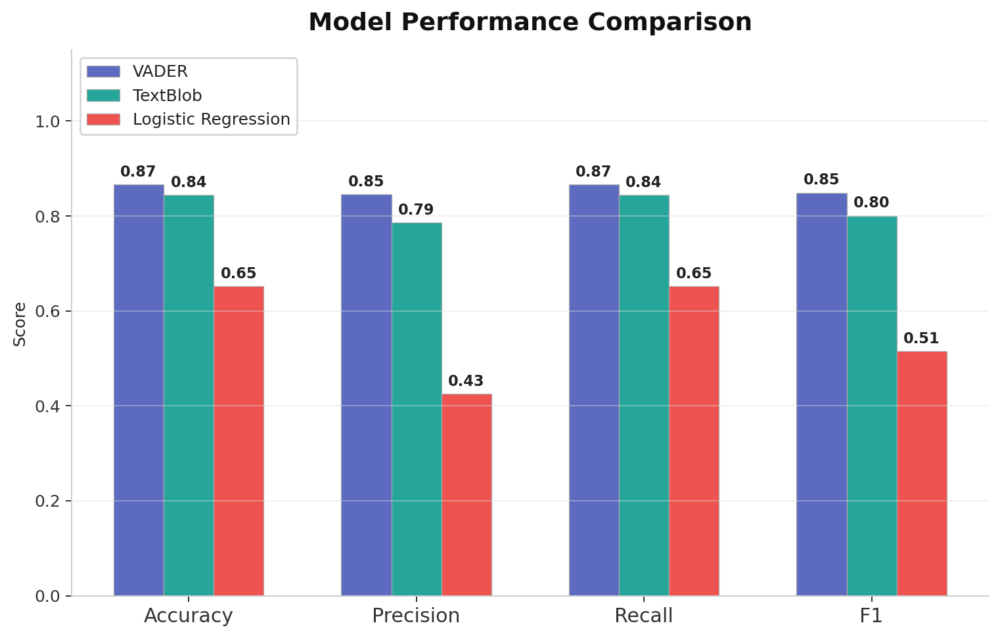
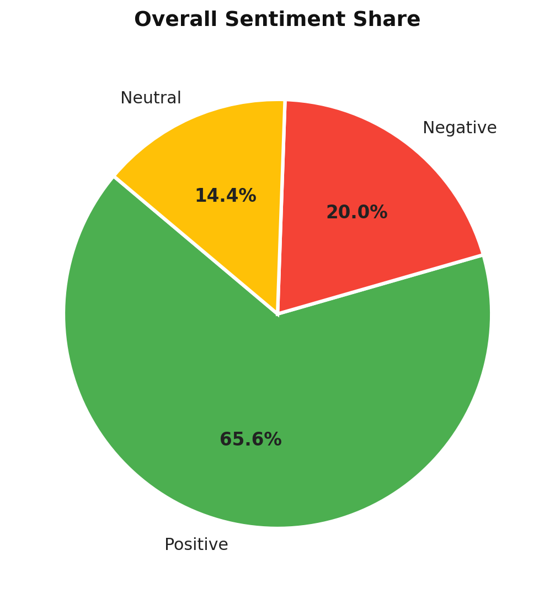
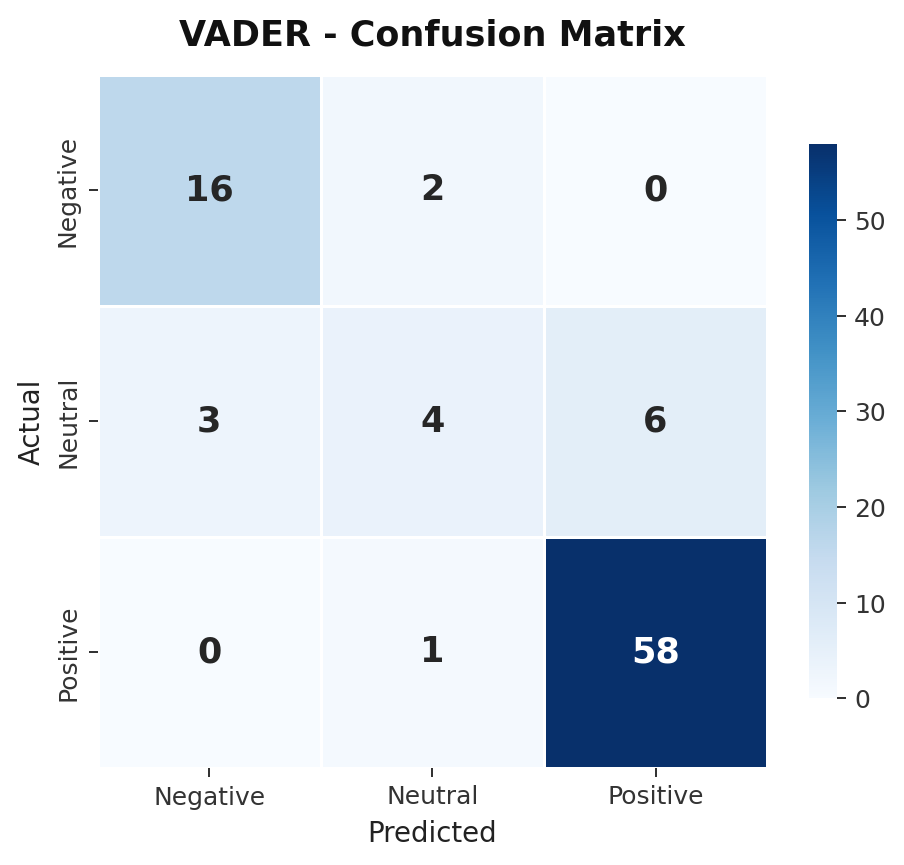
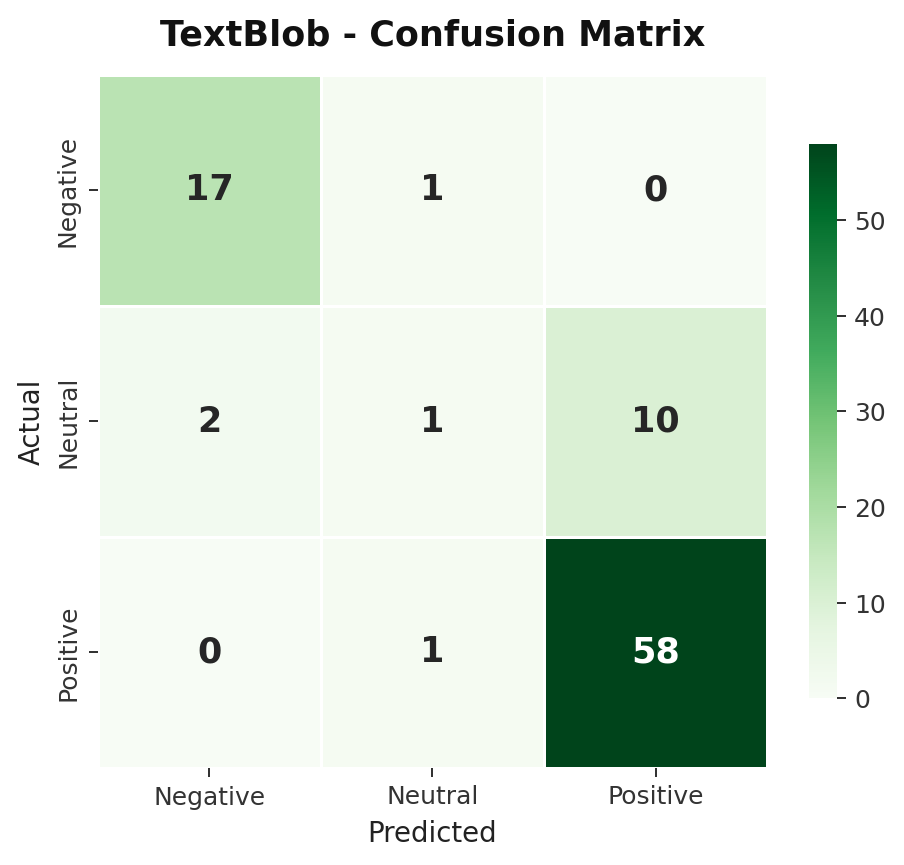
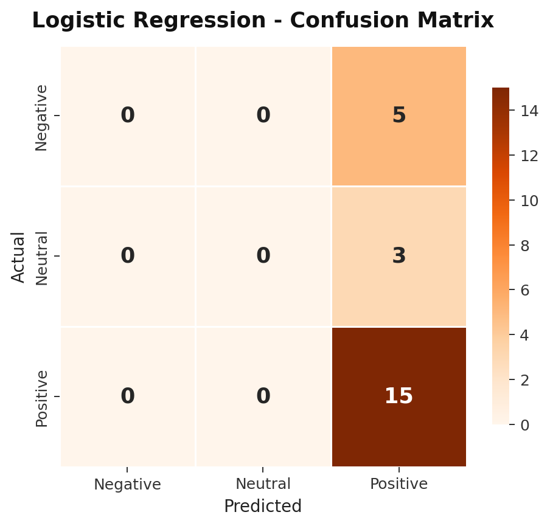

# 🍽️ Sentiment Analysis of Restaurant Reviews — Majitar, Sikkim

A complete NLP pipeline that analyzes Google reviews of restaurants in Majitar, Sikkim using **VADER**, **TextBlob**, and **Logistic Regression**, then uses sentiment scores to recommend the best restaurant for any dish.

## 📌 Problem Statement

> *"Can we analyze Google reviews using NLP to determine the sentiment towards restaurants in Majitar, Sikkim, and recommend the best place for a specific dish?"*

## 📊 Dataset

| Metric | Value |
|--------|-------|
| Total Reviews | 90 |
| Restaurants | 9 |
| Rating Scale | 1–5 stars |
| Sentiment Classes | Positive, Neutral, Negative |

**Restaurants covered:** Imperfecto Restro & Lounge, Punjabi Kitchen, Coffee Break, Down Town Restro & Bar, Baskin Robbins, SK01, KFC, Lapinos, Subway

## 🔧 Approach

```
Raw Reviews → Preprocessing → Sentiment Analysis → Evaluation → Food Recommender
                (Tokenize,       (VADER /          (Accuracy,     (User input →
                 Lemmatize,       TextBlob /         F1-Score,      Ranked
                 Stopwords)       Log. Regression)   Confusion)     Restaurants)
```

### Text Preprocessing
- Tokenization (splitting text into words)
- Lemmatization (converting words to base forms)
- Stopword removal (removing common words like "the", "is", "and")

### The 3 Models

| Model | Type | Training Required |
|-------|------|-------------------|
| **VADER** | Lexicon + Rule-based | No |
| **TextBlob** | Pattern-based NLP | No |
| **Logistic Regression** | Machine Learning (TF-IDF) | Yes (75% train split) |

## 📈 Results

| Model | Accuracy | Precision | Recall | F1-Score |
|-------|----------|-----------|--------|----------|
| **VADER** | **0.8667** | **0.8539** | **0.8667** | **0.8458** |
| TextBlob | 0.8444 | 0.7857 | 0.8444 | 0.7978 |
| Logistic Regression | 0.6522 | 0.4348 | 0.6522 | 0.5106 |

**Key Findings:**
- VADER performed best — its lexicon-based approach excels on review-style text
- TextBlob was a close second with zero training needed
- Logistic Regression struggled due to the small dataset size (90 reviews)

## 📊 Visualizations

<p align="center">
  
  
</p>
<p align="center">
  
  
</p>
<p align="center">
  
  
  
</p>

## 🍕 Food Recommender

An interactive CLI tool that recommends the best restaurant in Majitar for any dish based on sentiment analysis.

```
>> What do you want to eat? pizza

  >> Results for: "PIZZA"

  [1st]  Imperfecto Restro & Lounge
  Combined Score: 8.7 / 10   (1 review(s) matched)
  Avg Rating: [****.]  (4.0)
  VADER:  +0.844  |  TextBlob: +0.333  |  LR: 100%

  [2nd]  Lapinos
  Combined Score: 7.4 / 10   (10 review(s) matched)
  Avg Rating: [****.]  (3.8)
  VADER:  +0.373  |  TextBlob: +0.312  |  LR: 90%
```

**Scoring Formula:**
```
Combined Score = (0.4 × VADER + 0.3 × TextBlob + 0.3 × LR) × 10
```

**Searchable foods:** pizza, pasta, momos, thukpa, biryani, butter chicken, burger, milkshake, coffee, ice cream, sandwich, noodles, paratha, naan, paneer, and 25+ more.

## 🚀 How to Run

### Prerequisites
```bash
pip install nltk textblob scikit-learn pandas matplotlib seaborn
```

### Run Sentiment Analysis (with evaluation & plots)
```bash
python sentiment_analyzer.py
```

### Run Food Recommender (interactive)
```bash
python food_recommender.py
```

### Generate Individual Plot Images
```bash
python generate_plots.py
```

## 📁 Project Structure

```
├── reviews_data.py              # Dataset: 90 Google reviews + food keywords
├── sentiment_analyzer.py        # Full analysis pipeline + evaluation + visualizations
├── food_recommender.py          # Interactive CLI food recommender
├── generate_plots.py            # Generates individual plot images
├── plots/                       # Individual visualization PNGs
│   ├── 01_sentiment_distribution.png
│   ├── 02_sentiment_by_restaurant.png
│   ├── ...
│   └── 11_sentiment_pie.png
└── tanlp.pptx                   # Presentation slides
```

## 🛠️ Tech Stack

- **Python 3.13**
- **NLTK** — VADER sentiment analyzer, tokenization, lemmatization
- **TextBlob** — Pattern-based polarity & subjectivity
- **Scikit-learn** — Logistic Regression, TF-IDF, evaluation metrics
- **Matplotlib & Seaborn** — Visualizations
- **Pandas & NumPy** — Data handling

## 👩‍💻 Author

**Suhani Terway** (202300655)
Department of AI&DS
Sikkim Manipal Institute of Technology